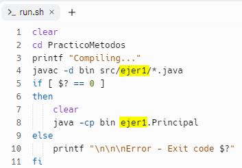

##  OBSERVACIONES
### Estos ejercicios pueden servir para comenzar en Programación 2
1) Los archivos ** .replit y run.sh ** son para que funcione en replit

2) Los archivos que tiene que tener en cuenta son los ** Principal.java ** que se encuentran en las carpetas 

3) Este proyecto quedará como plantilla para comenzar proyectos

4) Si cambia la estructura del Proyecto, hay que modificar el archivo **run.sh** para que funcione en replit
5) Si quiere ejecutar un programa, cambie en el archivo **run.sh** el nombre de la carpeta en los dos lugares que corresponde, por ejemplo: ver la siguiente imagen:
  
   
  
6) Para mantenerlo sincronizado con github, clonar el repositorio y abrir VSCode, clonar.
   
   
8) **Para usarlo en la PC, descargar el zip, descomprimirlo y copiar la carpeta en el workspace de eclipse,  
luego en Eclipse, crear un proyecto con el mismo nombre de la carpeta que se dejó en workspace.**

Ultima actualización diciembre del 2023

en github->(https://github.com/Programacion2-Practicos/Repaso-de-metodos)

Archivos copiados de: https://www.discoduroderoer.es/ejercicios-propuestos-y-resueltos-metodos-y-funciones-de-java/

------------------------------------------------------------------------------------------------------------------------------
Letra para realizar los ejercicios 2 y ejercicio 3
